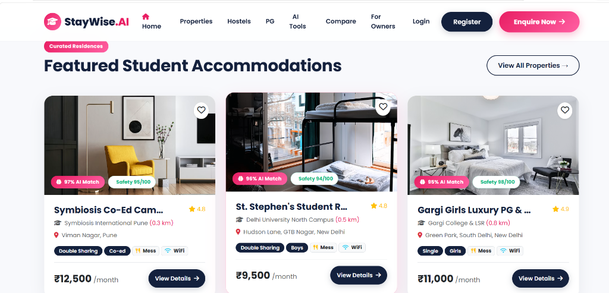
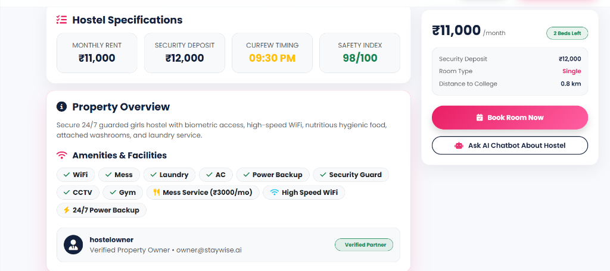

# 🎓 StayWise AI

**AI-Powered Student Accommodation Platform**

---

## 📖 About the Project

Finding a safe and affordable hostel near college can be frustrating. Students often have to browse multiple websites, compare rents manually, verify reviews, and contact different owners before making a decision.

To solve this problem, I built **StayWise AI**, an AI-powered student accommodation platform that helps students discover, compare, and book verified hostels, PGs, and rental rooms near their colleges.

The platform combines modern web technologies with Artificial Intelligence to provide personalized recommendations, smart hostel comparisons, budget planning, and secure booking—all in one place.

This project was developed to strengthen my skills in full-stack web development while solving a real-world problem faced by thousands of students.

---

## 🌐 Live Demo

👉 **Website**: [https://staywise-ai-lbvr.onrender.com](https://staywise-ai-lbvr.onrender.com)

---

## 📸 Project Screenshots

### 🏠 Home Page


### 🏡 Hostel Details Page
This page provides complete hostel information including pricing, amenities, safety index, room availability, booking option, and AI chatbot assistance.



---

## ✨ Key Features

### 🏠 Smart Hostel Search
- Search hostels by city or college
- Budget-based filtering
- Gender-specific accommodation
- Room type selection
- Safety Index (0-100)
- AI Match Score (%)
- Verified property listings

### 🤖 AI-Powered Features *(Powered by Google Gemini AI)*
- **AI Hostel Recommendations**
- **AI Budget Planner**
- **AI Hostel Comparison**
- **AI Chat Assistant**
- **AI Review Summarization**
- **AI Hostel Description Generator**

### 📅 Booking Management
- **Students can**:
  - Book rooms online
  - View booking history & digital receipts
  - Cancel bookings
  - Access booking details
- **Owners can**:
  - Manage hostel listings
  - Approve or decline booking requests
  - Monitor occupancy & available beds
  - Track revenue analytics

### 👨‍🎓 Student Dashboard
- Saved Wishlist
- Booking History
- In-App Notifications
- AI Recommendations
- Personal Profile

### 🏢 Owner Dashboard
- Add Hostel
- Edit Hostel
- Delete Hostel
- View Bookings
- Revenue Analytics
- Manage Available Beds

### ❤️ Wishlist
Students can save their favorite hostels and access them later.

### ⭐ Reviews
- Write Reviews
- Delete Reviews
- Like Helpful Reviews
- Owner Replies to Reviews

### 🔐 Authentication
- Student Registration
- Owner Registration
- Secure Login & Logout
- Session Management
- Role-Based Access Control
- Password Encryption using Passport.js

---

## 🛠 Tech Stack

- **Frontend**: HTML5, CSS3, Bootstrap 5, JavaScript, EJS, Font Awesome
- **Backend**: Node.js, Express.js
- **Database**: MongoDB Atlas, Mongoose
- **Authentication**: Passport.js, Passport Local, Express Session, Connect Mongo
- **Cloud Services**: Cloudinary, Multer
- **Artificial Intelligence**: Google Gemini API (`@google/genai`)

---

## 📂 Project Structure

```
StayWise-AI
│
├── controllers
├── models
├── routes
├── views
├── public
│   └── images
│       ├── homepage.png
│       └── hostel_details.png
├── utils
├── middleware.js
├── schema.js
├── cloudConfig.js
├── app.js
├── package.json
└── README.md
```

---

## 🚀 Getting Started

### Clone the Repository
```bash
git clone https://github.com/Karishma95kale/StayWise-AI.git
cd StayWise-AI
```

### Install Dependencies
```bash
npm install
```

### Create a `.env` File
```env
PORT=8080
MONGO_URI=your_mongodb_connection_string
SECRET=your_secret_key
CLOUD_NAME=your_cloudinary_name
CLOUD_API_KEY=your_cloudinary_api_key
CLOUD_API_SECRET=your_cloudinary_api_secret
GEMINI_API_KEY=your_google_gemini_api_key
```

### Run the Project

- **Development**:
  ```bash
  npm run dev
  ```

- **Production**:
  ```bash
  npm start
  ```

---

## 🔒 Security Features
- Secure Password Hashing
- Passport Authentication
- Session-Based Login
- MongoDB Session Storage
- Environment Variables
- Joi Input Validation
- Protected Routes
- Role-Based Authorization
